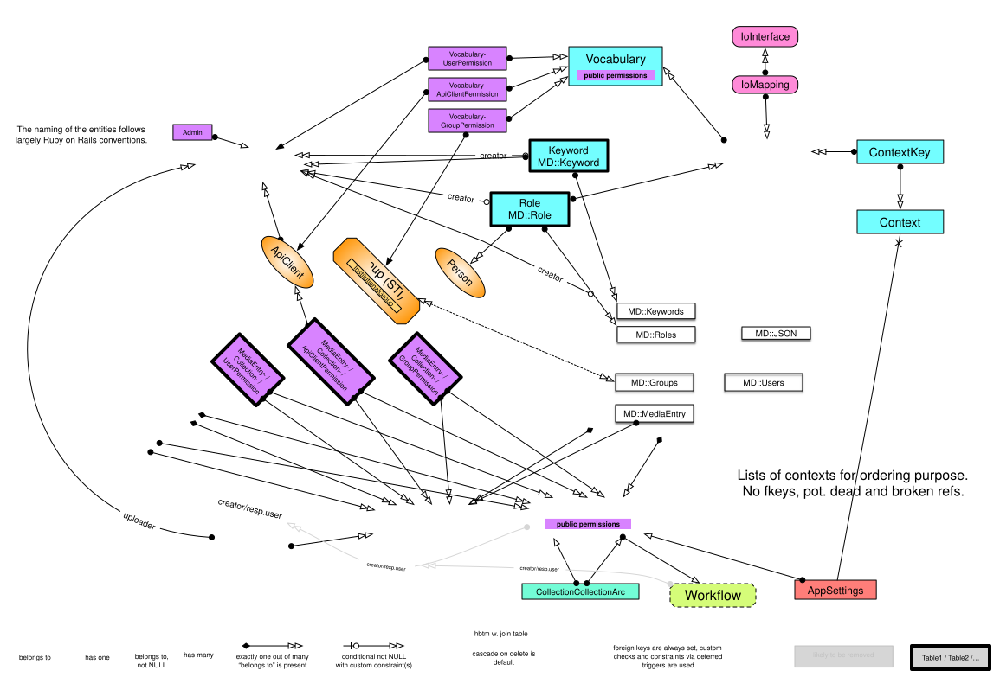
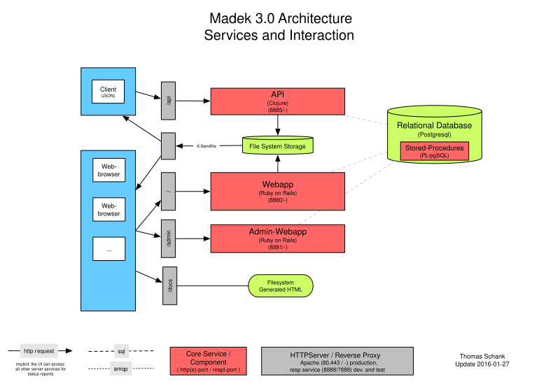

# Overview

## Database

The ER diagram assets (`database/entities_and_relations.*`) may **lag** the live
`datalayer/db/structure.sql`. Prefer the SQL structure and
[Entities](./entities.md) for current fields.

## Services

`services/overview.svg` may omit newer services. Prefer this list:

| Service | Role |
|---------|------|
| Reverse proxy | Path front door (`/`, `/api`, `/admin`, `/auth`, `/api-v2`) |
| webapp | Main UI |
| admin-webapp | `/admin` configuration UI |
| api | Classic JSON-ROA API (`/api`) |
| api-v2 | Optional OpenAPI API (`/api-v2`) |
| auth | Sign-in (`/auth`) |
| mail | Background SMTP worker (no HTTP front door) |
| datalayer | Shared models / migrations (not HTTP) |

`storage/` is a filesystem directory for originals/previews, **not** a service.
See [Madek at a glance](../start/madek-at-a-glance.md#components-and-request-flow).

---

# Special Topics

- [ResourceFilters](./resource_filters.md)
- [Entities](./entities.md)
- [Meta data config](./meta_data_config.md)
